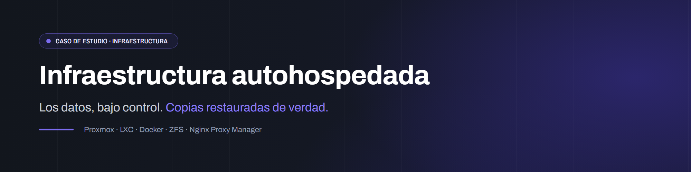
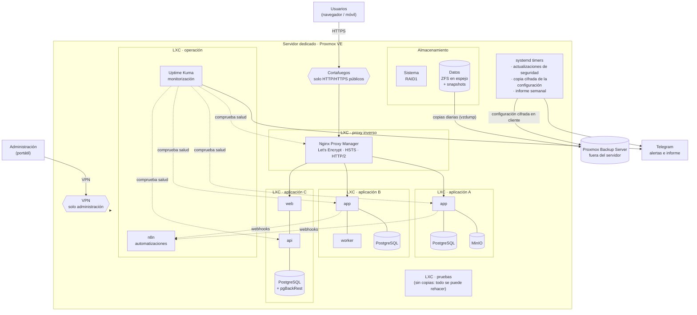

  

# Infraestructura autohospedada para aplicaciones internas

       

> [!NOTE]
> **Caso de estudio.** Plataforma que diseñé y administro para las aplicaciones internas de una empresa. Aquí están el problema, la arquitectura, las decisiones y [ejemplos genéricos](snippets/). No hay direcciones, nombres de máquinas, versiones exactas ni configuración de red o de acceso: se explica la idea, no la receta.

## El problema

Una empresa con varios centros de trabajo usa aplicaciones internas propias: control horario, un portal de proveedores, una mesa de ayuda para empleados y automatizaciones entre ellas. Algunas venían de un servidor anterior y otras eran nuevas. Hacía falta:

- **alojarlas sin depender de plataformas SaaS**, con los datos (fichajes, facturas, documentos firmados, tickets) **bajo control propio**;
- **aislar** cada aplicación, para que un fallo o una actualización en una no afecte a las demás;
- **HTTPS** para el público y **ninguna superficie de administración expuesta a internet**;
- **copias que se puedan restaurar de verdad**, también fuera del servidor y cifradas;
- **enterarse** cuando algo va mal, sin tener que mirar un panel cada día;
- y todo esto **mantenible por una sola persona**.

## La solución

Un servidor dedicado en un proveedor europeo con **Proxmox VE**. Cada aplicación vive en su propio **contenedor LXC** y, dentro de él, en su propio **stack de Docker Compose**.

- **Un contenedor LXC por aplicación**, más uno para el proxy inverso, uno para automatizaciones, uno para monitorización y uno de pruebas.
- **Proxy inverso** con certificados Let's Encrypt, HTTP/2 y HSTS. Es lo único que llega desde internet, y solo por HTTP y HTTPS.
- **Administración solo por VPN.** Ni el panel de Proxmox ni SSH ni el panel del proxy están abiertos a internet.
- **Copias en tres capas.** Snapshots ZFS frecuentes en el propio servidor, copias diarias de cada contenedor en local y copias **fuera del servidor** en un **Proxmox Backup Server** remoto. Las más sensibles van **cifradas en el cliente**.
- **Monitorización** con Uptime Kuma y alertas al móvil.
- **Actualizaciones de seguridad automáticas** (solo las de seguridad) y un **informe semanal por Telegram** con el estado del servidor.
- **Automatizaciones** con n8n, que conecta las aplicaciones sin que ninguna dependa de él.

## Arquitectura

Dentro de cada contenedor, el Compose separa **dos redes**:

- una **interna** (`internal: true`), sin salida a internet, donde viven la base de datos y el almacenamiento de objetos;
- una **de salida**, a la que solo se conecta la aplicación, porque necesita SMTP y webhooks.

El almacenamiento de objetos **no publica puertos ni tiene dominio**: los ficheros se sirven a través de la aplicación, después de validar la sesión.

## Decisiones técnicas

El detalle, con las alternativas descartadas, está en [docs/decisiones.md](docs/decisiones.md). Resumen:

| Decisión | Porqué |
|---|---|
| **LXC en lugar de VM** | Casi sin sobrecoste de memoria ni CPU, arranque en segundos y snapshots/copias nativos de Proxmox. Todas las cargas son Linux y basta con el aislamiento de un contenedor no privilegiado. |
| **Un Compose por contenedor** | Cada aplicación se actualiza, se copia, se restaura y se revierte sola. Un fallo de Docker en un contenedor no tumba a las demás. |
| **ZFS en espejo para los datos y RAID1 para el sistema** | Redundancia ante la pérdida de un disco, compresión, snapshots baratos y verificación periódica (*scrub*). Con la ARC limitada, ZFS no compite en memoria con los contenedores. |
| **Solo HTTP/HTTPS públicos y administración por VPN** | La superficie expuesta es solo el proxy. Paneles, SSH y bases de datos no son alcanzables desde internet. |
| **Redes Docker internas + de salida** | Las bases de datos no tienen ruta a internet, aunque se comprometa la aplicación. |
| **Copias en tres capas con PBS remoto** | Un snapshot en el mismo pool no es una copia. El PBS da deduplicación, verificación y retención gestionadas fuera del servidor. |
| **Cifrado en el cliente para lo sensible** | El servidor de copias guarda datos que no puede leer. La clave está en un gestor de contraseñas: sin ella no se recupera nada. |
| **Versiones fijadas** | Nada de `latest`: cada actualización es una decisión con vuelta atrás. |
| **Actualizaciones automáticas solo de seguridad** | Los parches de seguridad no esperan. El resto se actualiza a mano, en una ventana sin uso y con snapshot previo. |
| **Informe semanal por Telegram** | Un resumen que llega solo, con un icono de estado en la primera línea, en vez de un panel que nadie mira. |

## Cómo lo administro con Claude Code

La administración diaria (inventarios, diagnósticos, scripts, documentación) la hago con **Claude Code** en el propio servidor. El asistente trabaja con **reglas escritas** que carga en cada sesión, y el acceso privilegiado está acotado.

**Reglas que no se incumplen**, en un fichero de instrucciones del servidor:

- no tocar la configuración de red pública ni abrir puertos de administración;
- antes de cambiar cortafuegos o red, **snapshot y aviso**;
- las credenciales viven en un **gestor de contraseñas**, nunca en ficheros ni en el chat;
- **nunca parar un servicio en producción para probar una alerta.** Se prueba con un monitor contra una dirección inexistente o con un trabajo desechable que falle a propósito.

**Privilegios mínimos y temporales:**

- `sudo` pide contraseña.
- Cuando una fase necesita comandos de administración de Proxmox, se da un permiso **temporal y limitado a esos comandos**, y se retira al cerrar la fase. Queda comprobado que ya no funciona.
- Las auditorías de otros servidores se hacen **en solo lectura**, con el método documentado.

**Todo queda escrito:**

- un inventario como punto de entrada;
- un registro de cambios con lo verificado, lo corregido y lo aprendido;
- una lista de pendientes que se lee al empezar cada sesión;
- *runbooks* para las operaciones delicadas, como los cortes de migración.

Esta documentación forma parte de la copia cifrada que sale del servidor cada noche.

**Las decisiones son mías.** El asistente propone y ejecuta, pero lo irreversible o lo que cambia el comportamiento ante fallos se anota como «decisión pendiente» y espera mi confirmación. Por ejemplo, retirar una capa de copias, aunque sea técnicamente defendible.

## Estado actual

- **En producción desde septiembre de 2026.** Aloja tres aplicaciones de negocio, las automatizaciones, la monitorización y un entorno de pruebas.
- **Dos aplicaciones migradas** desde el servidor anterior, después de un ensayo general. En el segundo corte, el servicio estuvo parado **14 min 31 s**: desde la congelación hasta el HTTPS verificado. Antes de cambiar el DNS se comprobaron tablas con el mismo número exacto de filas, ficheros con el mismo SHA-256 tras pasar por la API S3, migraciones con sus fechas originales y firmas electrónicas válidas.
- **Restauración completa validada** desde el PBS remoto: un contenedor entero, arrancado **sin red** para que no mandara alertas falsas, con su servicio respondiendo y la base de datos idéntica a la original. Después se destruyó y se comprobó que no quedaba nada.
- **Alertas probadas en las dos ramas** (éxito y fallo), varias veces, y con **la recepción confirmada en el móvil**, no solo el «enviado».
- **Pendiente:** entornos de pruebas separados para las otras dos aplicaciones y decidir la retención de la capa de copias local.

## Lo que he aprendido

- **Una copia no está probada hasta que se restaura entera.** Y un clon restaurado trae la misma IP, la misma MAC y el arranque automático del original: hay que desactivarlos antes de encenderlo.
- **Una alerta que nunca ha disparado no está probada**, y una que ha disparado una vez tampoco. Un fallo intermitente (en mi caso, una ruta IPv6 que se colgaba a nivel TCP mientras `ping6` iba perfecto) hace que un mensaje de prueba que llega engañe. Por eso se prueban las dos ramas, varias veces seguidas.
- **«Aceptado» no es «entregado».** Un servidor de correo puede aceptar un mensaje y descartarlo después. La prueba termina cuando alguien confirma que lo ha recibido.
- **Leer la documentación del mecanismo, no solo la de la opción.** En APT las listas de orígenes se suman entre ficheros: sin limpiar la lista por defecto, las «actualizaciones solo de seguridad» instalaban de todo.
- **Quién es dueño de cada cosa.** Si la retención de copias se define en dos sitios, los dos compiten. El servidor de copias es el dueño y el hipervisor solo empuja.
- **Un script de copia que silencia sus errores es peor que no tenerlo**, porque da una falsa sensación de seguridad.
- **Con un asistente de IA en el servidor, las reglas escritas y los privilegios acotados son lo que permite delegar sin miedo.**
